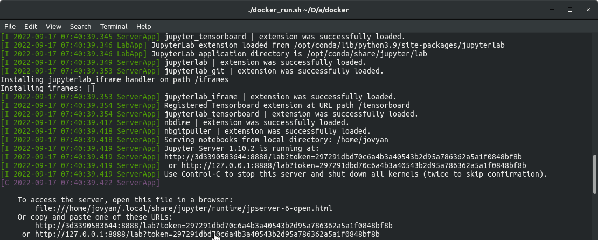

## Quick Start

All programming tasks can be run inside of a Docker container, which we provide. Our ACDC-Notebooks Docker container can be used for starting JupyterLab on you local machine. You can use the following instructions to run the container:


1. Clone this repository:
    ```bash
    git clone https://github.com/moa11/tp-va.git
    ```

2. Pull our ACDC-Notebooks Docker image from our registry:
    ```bash
    docker pull mooaa/syfra-va:1
    ```

3. In a terminal, navigate to the Docker directory of this repository and launch the ACDC-Notebooks Docker container with the provided run script:
    ```bash
    # tp-va/docker
    ./run.sh
    ```

    The Docker image should start now and your terminal should display some output similar to the one seen in the image below. Open the last link displayed in *your* terminal and JupyterLab will open in your browser.

    

4. Navigate to the `/tp-va/` directory in JupyterLab and open `index.ipynb` to get an overview of all available notebooks.


# tp-va

